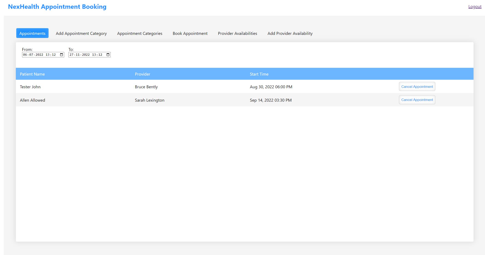

<h1>NexHealth QuickStart</h1>



- [Getting started](#getting-started)
- [Clone the repository](#clone-the-repository)
- [Configuration](#configuration)
- [Installation](#installation)
- [Starting the Node server and frontend app](#starting-the-node-server-and-frontend-app)

## Getting started

This repository was created to assist you in getting started with the [NexHealth API](https://docs.nexhealth.com/reference/introduction).
Using this repository, you can rapidly create a [Node](https://nodejs.org/en/) server that interacts with the NexHealth API for appointment scheduling and provider management.

You can book appointments, view them, and manage the providers using the frontend app built with [React](https://facebook.github.io/react/).

The user interface code can be found within the `frontend` folder, and the backend code can be found within the `server` folder.

## Clone the repository

Using https:

```sh
  git clone https://github.com/prabhuignoto/NexHealth
  cd NexHealth
```

Alternatively, if you use ssh:

```sh
git clone git@github.com:prabhuignoto/NexHealth.git
cd NexHealth
```

## Configuration

Please ensure that you have permission to use the NexHealth API. Fill out the [form](https://www.nexhealth.com/api-request/request-access) to request access.

Once you have access, you can populate the `.env` file under the `server` folder with the appropriate values.

> Both the front end and the back end apps comes with a sample `.env` file. Please make sure to update the values with your own.

Following are the mandatory values you would need to start the Node server successfully:

| Properties  | description                                                                                |
| :---------- | :----------------------------------------------------------------------------------------- |
| API_URL     | This will be the sandbox url used for testing purposes, e.g: https://sandbox.nexhealth.com |
| DOMAIN      | Refers to a specific Institution                                                           |
| LOCATION_ID | Refers to a specific location                                                              |
| API_KEY     |                                                                                            |

Similarly, change the location_id assigned to your account in the `.env` file under the `frontend` folder.

Here is how the Frontend app's `.env` file looks:

```sh
  REACT_APP_API=http://localhost:4000/api
  REACT_APP_LOCATION_ID=449
```

> Note: `.env` files are convenient for local development. Do not run production application using `.env` files.

Please contact the NexHealth team if you have any questions about these values.

## Installation

Install the required dependencies using the following command:

```sh

cd ./server
npm install

cd ./frontend
npm install

```

## Starting the Node server and frontend app

Navigate to the `server` folder and run the following command:

```sh
cd ./server
npm run start
```

If everything is working, you should see the following message:

```sh
[nodemon] reading config .\nodemon.json
[nodemon] to restart at any time, enter `rs`
[nodemon] or send SIGHUP to 14688 to restart
[nodemon] ignoring: .git node_modules/**/node_modules
[nodemon] watching path(s): *.js routers\*.js
[nodemon] watching extensions: js,json
[nodemon] starting `node --harmony index.js`
[nodemon] spawning
[nodemon] child pid: 11036
[nodemon] watching 8 files
Server is running on port 4000
```

Lets go ahead and start the frontend app.

```sh
cd ./frontend
npm run start
```

If everything was setup correctly, you should be able to access the ui at the following url: http://localhost:3000/